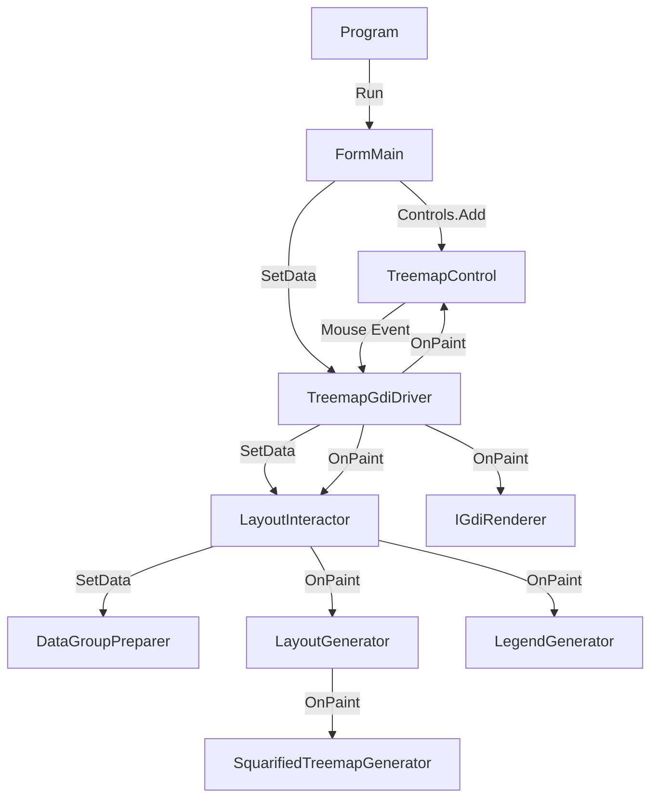
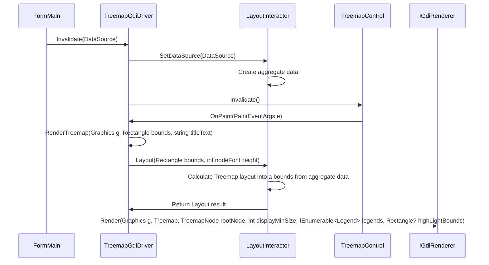

# SquarifiedTreemapLayers

SquarifiedTreemapLayers is a library for generating and rendering treemap layouts. This solution provides various functionalities related to treemaps, including layout generation, color calculation, and legend generation.

## Features

- Treemap layout generation
- Customizable color calculation
- Legend generation and display
- Compatible with .NET 8

## Overview

- `SquarifiedTreemapConsole` is an example console program that supports PNG saving and DataUrl output with given data and settings.
- `SquarifiedTreemapWinForms` is an example Windows Forms program that displays data, shows content at the mouse position in the status bar, provides interactive zoom on double-clicking group items, and allows immediate result verification upon changing settings in the configuration screen.
- TreemapGdiDriver serves as an entry point for WinForms development kits.
- LayoutInteractor serves as an entry point for Console development kits.

### PNG Saving Sample


### Configuration Screen


## Installation

### Installing SquarifiedTreemapForge.WinForms

To install the `SquarifiedTreemapForge.WinForms` development library, use the following command:

```cmd
dotnet add package SquarifiedTreemapForge --version 1.0.5
dotnet add package SquarifiedTreemapForge.WinForms --version 1.0.5
```

### Installing SquarifiedTreemapConsole

To install and run the `SquarifiedTreemapConsole` application, follow these steps:

1. Clone the repository:

```cmd
git clone https://github.com/yourusername/SquarifiedTreemapLayers.git
cd SquarifiedTreemapLayers/SquarifiedTreemapConsole
```

2. Build the project in Release mode to generate the executable:

```cmd
dotnet publish -c Release -r win-x64 --self-contained
```

This command will create a self-contained executable in the `bin\Release\net8.0\win-x64\publish` directory.

3. Navigate to the publish directory and run the executable:

```cmd
cd bin\Release\net8.0\win-x64\publish
SquarifiedTreemapConsole.exe <width> <height> <datapath> [pngfullpath]
```

Replace `<width>`, `<height>`, `<datapath>`, and `[pngfullpath]` with the appropriate values for your use case.

#### Sample Data and Configuration

Sample data and configuration examples can be found in the `SquarifiedTreemapLayers\sample\sales` folder.  

## Usage

### Minimal Setup Example

The following code demonstrates how to generate and render a treemap layout with minimal setup. The data file used in this example is `sample\sales\sales_data.json`.

```csharpusing System.Text.Json;
using Microsoft.Extensions.Options;
using SquarifiedTreemapForge;
using SquarifiedTreemapForge.Layout;
using SquarifiedTreemapForge.Shared;
using SquarifiedTreemapForge.WinForms;

var settings = new TreemapSettings();
var layoutSettings = new TreemapLayoutSettings { TitleText = "Visualizing Sales Revenue (Area) and Cost of Goods Sold Ratio (Color)", RootNodeTitle = "Total Sales", WeightColumn = "Weight", GroupColumns = ["Group1", "Group2", "Group3"], GroupBorderWidths = [4, 2], };
var legendSettings = new LegendSettings() { Width = 250, Height = 20, MinPer = 0.73, MaxPer = 1, MinBrightness = 0.2, MaxBrightness = 0.9, HuePositive = 2, HueNegative = 205, Saturation = 0.85, StepCount = 7, Margin = 1, IsOrderAsc = false, LegendFormat = "0%", IsShowLegend = true, IsShowPlusSign = true };

var interactor = new LayoutInteractor<PivotDataSource>(
    new LayoutGenerator<PivotDataSource>(new SquarifiedTreemapGenerator()),
    new DataGroupPreparer<PivotDataSource>(),
    new LegendGenerator()
);

var driver = new TreemapGdiDriver<PivotDataSource>(
    new GdiRenderer(), interactor, Options.Create(settings), Options.Create(layoutSettings), Options.Create(legendSettings))
{
    FuncNodeText = PivotDataSource.GetTitle,
    FuncPercentage = PivotDataSource.GetPercentage
};

var json = File.ReadAllText("sales_data.json");
var options = new JsonSerializerOptions { PropertyNameCaseInsensitive = true };
var data = JsonSerializer.Deserialize<IEnumerable<PivotDataSource>>(json, options) ?? [];
driver.Invalidate(data);

driver.Render(1024, 768)
    .Save("treemap.png", System.Drawing.Imaging.ImageFormat.Png);

Console.WriteLine($"Treemap image saved to {new FileInfo("treemap.png").FullName}");
```

### Dependency Injection Configuration Example

The following code demonstrates how to generate and render a treemap layout using Dependency Injection (DI).

```csharp
Host.CreateDefaultBuilder(args)
    .ConfigureServices((hostContext, services) =>
    {
        services.Configure<AppSettings>(
            hostContext.Configuration.GetSection("AppSettings"));
        services.Configure<TreemapSettings>(
            hostContext.Configuration.GetSection("TreemapSettings"));
        services.Configure<TreemapLayoutSettings>(
            hostContext.Configuration.GetSection("TreemapLayoutSettings"));
        services.Configure<LegendSettings>(
            hostContext.Configuration.GetSection("LegendSettings"));

        // Settings
        services.AddTransient<TreemapSettings>();
        services.AddTransient<TreemapLayoutSettings>();
        services.AddTransient<LegendSettings>();

        // this project
        services.AddTransient<FormMain>();

        // SquarifiedTreemapForge.WinForms.csproj
        services.AddTransient<TreemapGdiDriver<PivotDataSource>>();
        services.AddTransient<IGdiRenderer, GdiRenderer>();

        // SquarifiedTreemapForge.csproj
        services.AddTransient<LayoutInteractor<PivotDataSource>>();
        services.AddTransient<LayoutGenerator<PivotDataSource>>();
        services.AddTransient<DataGroupPreparer<PivotDataSource>>();
        services.AddTransient<LegendGenerator>();
        services.AddTransient<ITreemapGenerator, SquarifiedTreemapGenerator>();
    });
```

## System Architecture

### SquarifiedTreemapWinForms

The `SquarifiedTreemapWinForms` application is structured as follows:

#### Structure


- **Program**: The entry point of the application. It builds the host and runs the `FormMain`.
- **FormMain**: The main Windows form that provides the user interface.
- **TreemapGdiDriver<T>**: Responsible for rendering the treemap.
- **IGdiRenderer**: Uses GDI+ for rendering.
- **LayoutInteractor<T>**, **LayoutGenerator<T>**, **DataGroupPreparer<T>**, **LegendGenerator**, **SquarifiedTreemapGenerator**: Handle various aspects of treemap layout, data preparation, and legend calculation.

This architecture ensures a modular and maintainable codebase, allowing for easy extension and customization of the treemap functionalities.
    
#### Sequence diagram from data registration to drawing

Data is aggregated by the aggregation column. The result is held by LayoutInteractor and OnPaint uses the aggregated data to compute the rectangle.

### SquarifiedTreemapConsole

The `SquarifiedTreemapConsole` application is structured as follows:


- **Program**: The entry point of the application. It parses command-line arguments, builds the host, and runs the `Exporter`.
- **Exporter**: Handles the export process, including reading data, generating the treemap, and saving the output.
- **IGdiRenderer**: Uses GDI+ for rendering.
- **LayoutInteractor<T>**, **LayoutGenerator<T>**, **DataGroupPreparer<T>**, **LegendGenerator**, **SquarifiedTreemapGenerator**: Handle various aspects of treemap layout, data preparation, and legend calculation.

This architecture ensures a modular and maintainable codebase, allowing for easy extension and customization of the treemap functionalities.


## License

This project is licensed under the MIT License.
