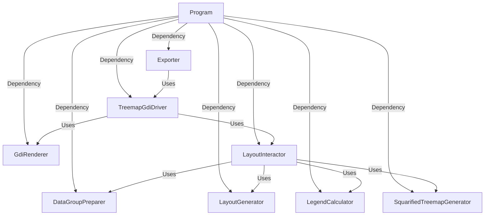
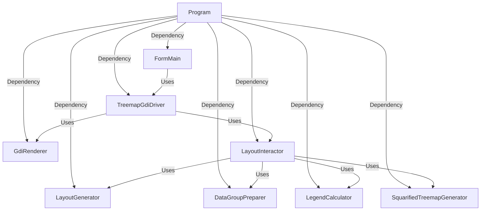

# SquarifiedTreemapLayers

SquarifiedTreemapLayers is a library for generating and rendering treemap layouts. This solution provides various functionalities related to treemaps, including layout generation, color calculation, and legend generation.

## Features

- Treemap layout generation
- Customizable color calculation
- Legend generation and display
- Compatible with .NET 8

## System Architecture

### SquarifiedTreemapConsole

The `SquarifiedTreemapConsole` application is structured as follows:



#### Components

- **Program**: The entry point of the application. It parses command-line arguments, builds the host, and runs the `Exporter`.
- **Exporter**: Handles the export process, including reading data, generating the treemap, and saving the output.
- **TreemapGdiDriver<PivotDataSource>**: Responsible for rendering the treemap.
- **GdiRenderer**: Uses GDI+ for rendering.
- **LayoutInteractor<PivotDataSource>**, **LayoutGenerator<PivotDataSource>**, **DataGroupPreparer<PivotDataSource>**, **LegendCalculator**, **SquarifiedTreemapGenerator**: Handle various aspects of treemap layout, data preparation, and legend calculation.

This architecture ensures a modular and maintainable codebase, allowing for easy extension and customization of the treemap functionalities.

### SquarifiedTreemapWinForms

The `SquarifiedTreemapWinForms` application is structured as follows:



#### Components

- **Program**: The entry point of the application. It builds the host and runs the `FormMain`.
- **FormMain**: The main Windows form that provides the user interface.
- **TreemapGdiDriver<PivotDataSource>**: Responsible for rendering the treemap.
- **GdiRenderer**: Uses GDI+ for rendering.
- **LayoutInteractor<PivotDataSource>**, **LayoutGenerator<PivotDataSource>**, **DataGroupPreparer<PivotDataSource>**, **LegendCalculator**, **SquarifiedTreemapGenerator**: Handle various aspects of treemap layout, data preparation, and legend calculation.

This architecture ensures a modular and maintainable codebase, allowing for easy extension and customization of the treemap functionalities.

## Installation

To install and run the `SquarifiedTreemapConsole` application, follow these steps:

1. Clone the repository:

```
git clone https://github.com/yourusername/SquarifiedTreemapLayers.git cd SquarifiedTreemapLayers/SquarifiedTreemapConsole
```

2. Build the project in Release mode to generate the executable:
```
dotnet publish -c Release -r win-x64 --self-contained
```
This command will create a self-contained executable in the `bin\Release\net8.0\win-x64\publish` directory.

3. Navigate to the publish directory and run the executable:
```
cd bin\Release\net8.0\win-x64\publish SquarifiedTreemapConsole.exe <width> <height> <datapath> [pngfullpath]
```
Replace `<width>`, `<height>`, `<datapath>`, and `[pngfullpath]` with the appropriate values for your use case.

### Sample Data and Configuration

Sample data and configuration examples can be found in the `SquarifiedTreemapLayers\sample\population` folder. 

## Usage

### Generating a Treemap

The following code demonstrates how to generate and render a treemap layout.

```csharp
using System.Text.Json;
using SquarifiedTreemapForge;
using SquarifiedTreemapForge.Layout;
using SquarifiedTreemapForge.WinForms;
using SquarifiedTreemapInteractor;
using SquarifiedTreemapShared;

var settings = new TreemapSettings();
var layoutSettings = new TreemapLayoutSettings { TitleText = "Visualizing Sales Revenue (Area) and Cost of Goods Sold Ratio (Color)", RootNodeTitle = "Total Sales", WeightColumn = "Weight", GroupColumns = ["Group1", "Group2", "Group3"], GroupBorderWidths = [4, 2], };
var legendSettings = new LegendSettings() { Width = 250, Height = 20, MinPer = 0.73, MaxPer = 1, MinBrightness = 0.2, MaxBrightness = 0.9, HuePositive = 2, HueNegative = 205, Saturation = 0.85, StepCount = 7, Margin = 1, IsOrderAsc = false, LegendFormat = "0%", IsShowLegend = true, IsShowPlusSign = true };
var renderer = new GdiRenderer();

var interactor = new LayoutInteractor<PivotDataSource>(
    new LayoutGenerator<PivotDataSource>(new SquarifiedTreemapGenerator()),
    new DataGroupPreparer<PivotDataSource>(),
    new LegendCalculator()
);

var driver = new TreemapGdiDriver<PivotDataSource>(renderer, interactor, settings, layoutSettings, legendSettings)
{
    FuncNodeText = PivotDataSource.GetTitle,
    FuncPercentage = PivotDataSource.GetPercentage
};

var json = File.ReadAllText(@"..\..\..\..\..\sample\sales\sales_data.json");
var options = new JsonSerializerOptions { PropertyNameCaseInsensitive = true };
var data = JsonSerializer.Deserialize<IEnumerable<PivotDataSource>>(json, options) ?? [];
driver.Invalidate(data);

driver.Render(1024, 768)
    .Save("treemap.png", System.Drawing.Imaging.ImageFormat.Png);

Console.WriteLine($"Treemap image saved to {new FileInfo("treemap.png").FullName}");
```

### Treemap image


## Customizable

layout color legend

see SquarifiedTreemapLayers\src\SquarifiedTreemapWinForms

https://github.com/panda728/SquarifiedTreemapLayers/issues/2#issue-2932191192

## Contributing

Contributions are welcome. Feel free to report bugs, suggest new features, or submit pull requests.

1. Fork this repository.
2. Create a feature branch (`git checkout -b feature/YourFeature`).
3. Commit your changes (`git commit -am 'Add some feature'`).
4. Push to the branch (`git push origin feature/YourFeature`).
5. Create a new Pull Request.

## License

This project is licensed under the MIT License. 
